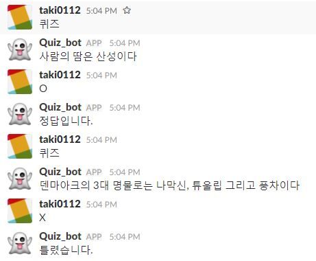

# Slack_Quiz_bot
Slack Quiz bot

## Usage
* Maybe you should be invited *[here](https://taki0112.slack.com/messages/@bot_test/)*
* If you let me know your Slack email, I will invite you. (*takis0112@gmail.com*)
* The bot will quiz when the word "퀴즈" is entered.
* After the quiz, if you entered "O" or "X", the bot will tell you the correct answer. (**Please enter capital letters.**)

## Result

## Author
Junho Kim
